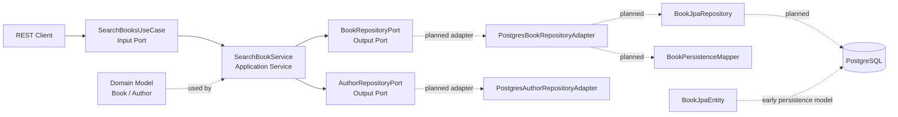
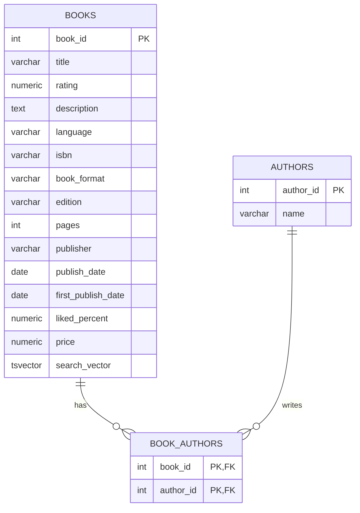

# Book Search Engine

Backend portfolio project built with **Java**, **Spring Boot** and **PostgreSQL**, focused on CSV data ingestion, relational data modeling and full-text search capabilities.

The application stores book and author information, normalizes many-to-many relationships between books and authors, and enables efficient search over book metadata using PostgreSQL Full-Text Search.

---

## Overview

Book Search Engine is a backend application designed to demonstrate practical backend engineering skills beyond a basic CRUD API.

The project covers:

* CSV data ingestion.
* Relational database modeling.
* Many-to-many relationships.
* PostgreSQL Full-Text Search.
* Search ranking using `tsvector` and `tsquery`.
* REST API design.
* Clean backend architecture foundations.

The goal is to build a small but well-structured backend system that can be presented as a professional portfolio project.

---

## Tech Stack

| Layer          | Technology                  |
| -------------- | --------------------------- |
| Language       | Java                        |
| Framework      | Spring Boot                 |
| Database       | PostgreSQL                  |
| Build Tool     | Maven                       |
| Data Ingestion | OpenCSV / JDBC              |
| Search Engine  | PostgreSQL Full-Text Search |
| API Style      | REST                        |
| Documentation  | Markdown + Mermaid          |

---

## Main Features

* Import books from a CSV source.
* Store books and authors in normalized relational tables.
* Support books with one or more authors.
* Support authors associated with multiple books.
* Define search use cases and repository contracts with hexagonal ports.
* Validate search queries at application service level.
* Provide a clean foundation for REST and persistence adapters.

---

## System Architecture

The application is implemented using **Hexagonal Architecture (Ports and Adapters)** to keep business rules independent from frameworks and infrastructure details.

Core domain logic lives in the center (`domain` + `application`), while technical concerns such as persistence are implemented as adapters in `infrastructure`.

### Package Structure

```text
src/main/java/com/h2
├── App.java
├── DbImporter.java
│
├── domain
│   └── model
│       ├── Book.java
│       └── Author.java
│
├── application
│   ├── port
│   │   ├── in
│   │   │   └── SearchBooksUseCase.java
│   │   └── out
│   │       └── BookRepositoryPort.java
│   │       └── AuthorRepositoryPort.java
│   └── service
│       └── SearchBookService.java
│
└── infrastructure
    └── persistance
        └── entity
            └── BookJpaEntity.java
```



### Architecture Description

The system is composed of the following main components:

| Component | Responsibility |
| --------- | -------------- |
| Domain (`domain.model`) | Represents core business entities (`Book`, `Author`) without framework dependencies. |
| Input Port (`application.port.in`) | Defines use cases exposed to the outside world (`SearchBooksUseCase`). |
| Application Service (`application.service`) | Orchestrates use case execution and validation (`SearchBookService`). |
| Output Ports (`application.port.out`) | Defines persistence contracts (`BookRepositoryPort`, `AuthorRepositoryPort`). |
| Persistence Layer (current status) | `BookJpaEntity` exists as an initial persistence model; adapters/repositories are pending implementation. |
| Import Utility (`DbImporter`) | Downloads CSV, parses records and inserts books/authors relationships into PostgreSQL. |
| PostgreSQL + FTS | Stores data and executes full-text search (`tsvector`, `tsquery`, ranking). |

---

## Database Model

The database model is based on three main tables:

* `books`
* `authors`
* `book_authors`

This structure allows a **many-to-many relationship** between books and authors.

A book can have many authors, and an author can be associated with many books.



---

## Entity Relationship Explanation

### `books`

Stores the main information about each book.

Relevant columns:

| Column          | Description                                 |
| --------------- | ------------------------------------------- |
| `book_id`       | Primary key of the book.                    |
| `title`         | Book title.                                 |
| `description`   | Book description.                           |
| `isbn`          | Book ISBN.                                  |
| `publisher`     | Book publisher.                             |
| `search_vector` | Full-text search vector used by PostgreSQL. |

---

### `authors`

Stores author information.

Relevant columns:

| Column      | Description                |
| ----------- | -------------------------- |
| `author_id` | Primary key of the author. |
| `name`      | Author name.               |

The `name` column should be unique to avoid duplicated authors during CSV ingestion.

---

### `book_authors`

Bridge table used to represent the many-to-many relationship between books and authors.

Relevant columns:

| Column      | Description                                  |
| ----------- | -------------------------------------------- |
| `book_id`   | Foreign key referencing `books.book_id`.     |
| `author_id` | Foreign key referencing `authors.author_id`. |

The primary key is composed of both columns:

```sql
PRIMARY KEY (book_id, author_id)
```

This prevents the same book-author relationship from being inserted more than once.

---

## Relationship Example

A book can be related to an author through the `book_authors` table.

Example:

```text
books
book_id | title
--------|-----------------------------------------
1       | The Essentials of Artificial Intelligence

authors
author_id | name
----------|---------------
1         | Steve Wozniak

book_authors
book_id | author_id
--------|----------
1       | 1
```

This means:

```text
"The Essentials of Artificial Intelligence" was written by Steve Wozniak.
```

---

## Query Example: Books by Author

```sql
SELECT
    b.*,
    a.name AS author_name
FROM books b
JOIN book_authors ba ON b.book_id = ba.book_id
JOIN authors a ON ba.author_id = a.author_id
WHERE a.name = 'Steve Wozniak';
```

This query works by:

1. Starting from the `books` table.
2. Joining with `book_authors` using `book_id`.
3. Joining with `authors` using `author_id`.
4. Filtering the result by author name.

---

## Full-Text Search Overview

PostgreSQL Full-Text Search is used to search books efficiently by relevant text fields.

The `search_vector` column stores a preprocessed representation of searchable text.

Example fields used for search:

* `title`
* `description`
* `isbn`

Example search vector update:

```sql
UPDATE books
SET search_vector =
    setweight(to_tsvector('english', coalesce(title, '')), 'A') ||
    setweight(to_tsvector('english', coalesce(description, '')), 'B') ||
    setweight(to_tsvector('english', coalesce(isbn, '')), 'C');
```

The weights define search relevance:

| Field         | Weight | Meaning           |
| ------------- | ------ | ----------------- |
| `title`       | A      | Highest relevance |
| `description` | B      | Medium relevance  |
| `isbn`        | C      | Lower relevance   |

---

## Search Query Example

```sql
SELECT
    book_id,
    title,
    isbn,
    ts_rank(
        search_vector,
        plainto_tsquery('english', 'artificial intelligence')
    ) AS rank
FROM books
WHERE search_vector @@ plainto_tsquery('english', 'artificial intelligence')
ORDER BY rank DESC;
```

This query returns books matching the search phrase and orders them by relevance.

---

## Current Project Scope

The current scope focuses on:

* Database schema design.
* CSV data ingestion.
* Full-text search configuration.
* Hexagonal architecture implementation (ports and adapters).
* SQL queries for search and relationships.
* Professional documentation.

---

## Planned Improvements

Future improvements may include:

* Implement persistence adapters and Spring Data repositories for output ports.
* Complete JPA entities and mappers for domain-to-persistence conversion.
* Expose REST endpoints for books and authors.
* Add DTOs and request/response mappers.
* OpenAPI / Swagger documentation.
* Flyway or Liquibase migrations.
* Pagination and sorting.
* Unit tests with JUnit and Mockito.
* Integration tests with Testcontainers.
* GitHub Actions CI pipeline.
* Search endpoint using `websearch_to_tsquery`.
* Automatic `search_vector` updates using PostgreSQL triggers.

---

## Suggested API Endpoints

| Method | Endpoint                                      | Description             |
| ------ | --------------------------------------------- | ----------------------- |
| `GET`  | `/api/books`                                  | List books.             |
| `GET`  | `/api/books/{id}`                             | Get book by ID.         |
| `GET`  | `/api/books/search?q=artificial intelligence` | Search books by text.   |
| `GET`  | `/api/authors/{id}/books`                     | Get books by author ID. |
| `GET`  | `/api/authors?name=Steve Wozniak`             | Search authors by name. |
| `POST` | `/api/books/import`                           | Trigger CSV ingestion.  |

---

## Repository Goal

This repository is intended to showcase backend engineering skills including:

* Relational modeling.
* SQL and PostgreSQL usage.
* Data ingestion.
* Search optimization.
* API design.
* Clean architecture thinking.
* Technical documentation.

The project can be used as a portfolio piece for Java Backend Developer, Senior Java Developer or Solutioning-oriented roles.
